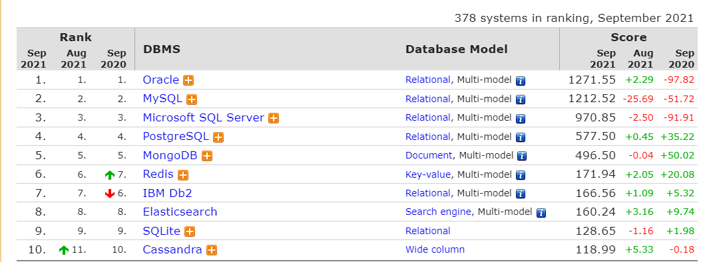

# MongoDB

MongoDB是一种基于**分布式文件存储**的NoSQL数据库。由C++语言编写。旨在为WEB英语提供可扩展的高性能数据存储方案。 
MongoDB是一个介于关系型数据库和非关系型数据之间的产品，是非关系型数据库当中功能最丰富，最像关系型数据的。

## MongoDB特点
- 模式自由：可以把不同结构的文档存储到同一个数据库中。
- 面向集合的存储：适合存储JSON风格文件的形式。
- 完整的索引支持：对任何属性可索引。
- 自动分片：支持云级别的伸缩，自动分片功能支持水平的数据库集群，可动态添加额外的机器。
- 高效的传统存储方式：支持二进制数据及大对象（图片等）。
- 丰富的查询功能：支持丰富的查询方式，支持使用JSON形式，可以轻易的查询文档中嵌套（内嵌）的对象或数据。
- 复制性高可用性：支持服务器之间的数据复制，支持主从模式及服务器之间的相互复制，复制的主要目的是提供冗余及自动故障转移。
- 快速的更新操作：查询优化器会分析查询表达式，并生成一个高效的查询计划。

根据DB-Engine-Ranking的排名统计截止到2021年-9月Mongodb排名第五，见截图：

